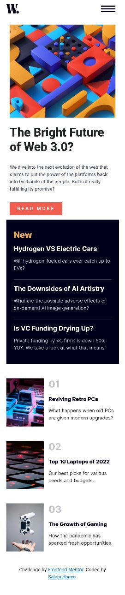

# Frontend Mentor - News homepage solution

This is a solution to the [News homepage challenge on Frontend Mentor](https://www.frontendmentor.io/challenges/news-homepage-H6SWTa1MFl). Frontend Mentor challenges help you improve your coding skills by building realistic projects. 

## Table of contents

- [Overview](#overview)
  - [The challenge](#the-challenge)
  - [Screenshot](#screenshot)
  - [Links](#links)
- [My process](#my-process)
  - [Built with](#built-with)
- [Author](#author)

## Overview

### The challenge

Users should be able to:

- View the optimal layout for the interface depending on their device's screen size
- See hover and focus states for all interactive elements on the page
- **Bonus**: Toggle the mobile menu (requires some JavaScript)

### Screenshot

Mobile View

### Links

- Solution URL: [Sulution](https://github.com/salahudheen007/news-homepage-main)
- Live Site URL: [live site](https://salahudheen007.github.io/news-homepage-main/)

## My process

### Built with

- Semantic HTML5 markup
- CSS custom properties
- Flexbox
- CSS Grid
- Mobile-first workflow
--[Vite](https://vitejs.dev/) 
- [VueJs](https://vuejs.org/)

## Author

- Frontend Mentor - [@salahudheen007](https://www.frontendmentor.io/profile/salahudheen007)
- LinkedIn - [@salahudheen k](https://www.linkedin.com/in/salahudheen-k-7574ba1a6/)

